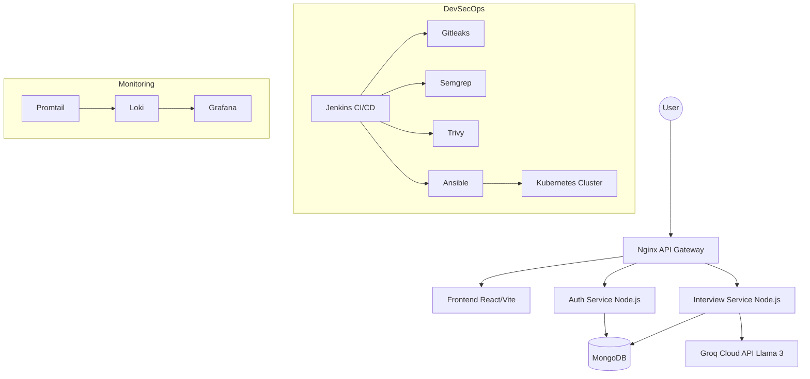

# Scholar's Study — Full Stack AI Interview Platform

Scholar's Study is a production-grade AI-powered mock interview platform built with a modern microservices architecture and DevSecOps integration.

## 🏗 Architecture



## 🚀 Tech Stack

- **Frontend**: React.js, Vite, Tailwind CSS, Framer Motion, Web Speech API.
- **Backend**: Node.js, Express.js, MongoDB, Groq SDK.
- **DevOps**: Docker, Kubernetes, Jenkins, Ansible, Nginx.
- **Security**: Gitleaks, Semgrep, Trivy, OWASP ZAP.
- **Monitoring**: Loki, Promtail, Grafana.

## 📂 Folder Structure

```text
scholars-study/
├── auth-service/       # User management & JWT Auth
├── interview-service/  # AI Interview logic & Groq integration
├── frontend/           # React + Vite application
├── nginx/              # API Gateway configuration
├── kubernetes/         # K8s Manifests (Deployments, HPA, Ingress)
├── ansible/            # Playbooks for setup and deployment
├── monitoring/         # Loki/Grafana logging stack
├── docker-compose.yml  # Local orchestration
├── Jenkinsfile         # CI/CD Pipeline definition
└── README.md
```

## 🛠 Getting Started

### Prerequisites
- Node.js & Docker installed.
- Groq Cloud API Key.
- MongoDB instance (local or Atlas).

### Local Run
1. Clone the repository.
2. Create a `.env` file in the root with:
   ```env
   GROQ_API_KEY=your_key_here
   JWT_SECRET=your_secret_here
   ```
3. Run `docker-compose up --build`.
4. Access at `http://localhost`.

### Deployment
- **Ansible**: Run `ansible-playbook ansible/playbooks/setup-environment.yml` to prepare the host.
- **Kubernetes**: Run `kubectl apply -f kubernetes/scholar-study/` to deploy the cluster.

## 🛡 Security Workflow
The CI/CD pipeline enforces:
1. **Secret Scanning**: Gitleaks detects exposed keys.
2. **SAST**: Semgrep analyzes code for vulnerabilities.
3. **SCA**: Trivy scans dependencies.
4. **Container Security**: Trivy scans Docker images.
5. **DAST**: OWASP ZAP baseline scan on live environment.

## 📊 Monitoring
Logs are centralized in Loki and visualized in Grafana.
- **Loki**: `http://localhost:3100`
- **Grafana**: `http://localhost:3001` (User: admin, Pass: admin)
